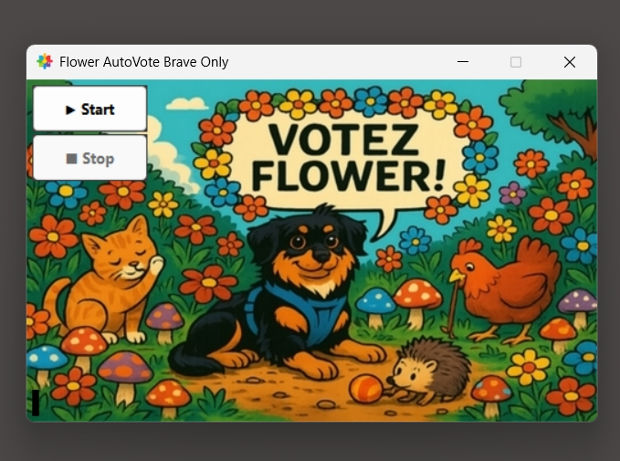

# 🌸 Flower AutoVote - KingPet Bot pour Brave

Bienvenue dans **Flower AutoVote**, un petit robot personnel pour voter automatiquement sur [KingPet](https://www.kingpet.fr/vote/flower437) via le navigateur **Brave** !  
Parce qu’il n’y a rien de plus loyal qu’un script qui clique pour son animal préféré 🐶🐱🐹🐾

---

## ✨ Fonctionnalités

- ✅ **Connexion automatique** à une instance Brave déjà ouverte (via `--remote-debugging-port`)
- 🌐 **Navigation automatique** vers la page KingPet de Flower
- 🤖 **Clic automatique** sur le bouton "Voter", puis "Gratuit"
- 🔁 **Répétition toutes les 10 minutes**
- 🛑 **Bouton Stop** pour interrompre le bot à tout moment (threads stoppés proprement)
- 🎨 Interface graphique simple, en Tkinter avec arrière-plan personnalisé
- ⚠️ Popup d’aide pour installer Brave et créer le bon profil
- 🔍 Détection intelligente d’instances Brave conflictuelles
- 🧪 Suivi du temps restant avant le prochain vote + compteur de votes effectués

---

## 🛠 Technologies utilisées

- `Python 3.x`
- `Tkinter` — interface utilisateur
- `Selenium` — contrôle du navigateur
- `psutil` — gestion des processus pour détecter Brave
- `PIL / Pillow` — affichage et animation du logo
- `WebDriver` (Chromedriver) — pour piloter Brave
- `Brave Browser` — navigateur basé sur Chromium avec support debug

---

## 🚀 Installation & Lancement

1. **Installe Python 3.9+**  
   https://www.python.org/downloads/

2. **Installe les dépendances** :  
   ```bash
   pip install selenium pillow psutil
   ```

3. **Installe Brave Browser** (si ce n’est pas déjà fait)  
   https://brave.com/fr/download/

4. **Place/remplace le chromedriver dans le dossier `driver/`**  
   (compatible avec ta version de Brave/Chromium)

5. **Lance le script**  
   ```bash
   python autovote_dl_button_moved.py
   ```

---

## 📷 Aperçu



---

## ✍️ Auteurs

**Développé par Fawn**
- 🧠 Aide : ChatGPT, ton assistant Python fidèle

- 🎬 Démos vidéo : [http://ninjaaior.free.fr/devdemos/index.html](http://ninjaaior.free.fr/devdemos/index.html)

---

## 📁 Organisation du projet

```
📁 ton-dossier/
├── autovote_dl_button_moved.py     # Le script principal
├── driver/
│   └── chromedriver.exe            # WebDriver
├── img/
│   ├── Fond.jpg                    # Image de fond pour la fenêtre
│   └── logo_fleur.png             # Logo animé dans la popup
└── FlowerProfileReady.flag         # Flag pour vérifier le setup
```

---

## 🧠 Comment ça marche ?

1. Au premier lancement, une **popup guide l'utilisateur** pour installer Brave et se connecter à KingPet.
2. Une fois confirmé, Brave est lancé avec un **profil spécifique** + **port debug**.
3. Le bot utilise **Selenium attaché à Brave** pour naviguer, cliquer et voter.
4. Tous les 10 minutes, il recommence — **sauf si tu cliques sur STOP**.
5. Le système empêche les conflits avec d'autres instances de Brave.

---

## 💡 À savoir

- Ne fonctionne **qu’avec Brave** (pas Chrome, Edge, etc.)
- L’utilisateur doit se connecter une fois manuellement sur KingPet
- Le script ne contourne **aucune sécurité**, il simule un vote manuel.

---


## 🐶 Personnalisation

> 💡 Si tu veux utiliser ce script pour ton propre animal de compagnie, il te suffit de **changer l’URL KingPet** dans le code (ligne avec `https://www.kingpet.fr/vote/flower437`) et d’y mettre le **lien vers la page de ton animal**.  

> Exemple :  
> ```python
> VOTE_URL = "https://www.kingpet.fr/vote/tonanimal123"
> ```

## 🧙 Idées futures

- Ajouter une **planification automatique sur plage horaire**
- Support **multicomptes / multi-profils**
- Version **portable** (sans Python requis)
- Interface **plus funky** (avec des fleurs qui dansent 🌼)

---

## 🐾 Soutien moral

Si ce script t’aide à le faire gagner, n’oublie pas d’offrir une friandise à ton compagnon à 4 pattes 💝

---

## ☕ Offrez un p'tit café au développeur ?

Si cet outil vous a été utile, vous pouvez soutenir le développement (et la consommation excessive de café ☕) ici :

➡️ [](https://www.paypal.com/paypalme/noobpythondev)

Un grand merci ! 💙

---

## ⚠️ Disclaimer

> Ce projet est un outil personnel, fourni à des fins éducatives.  
> À utiliser de manière responsable, dans le respect des règles du site KingPet.

